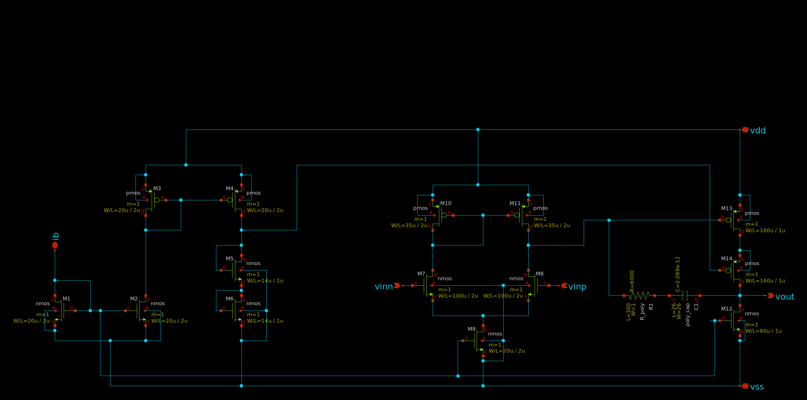
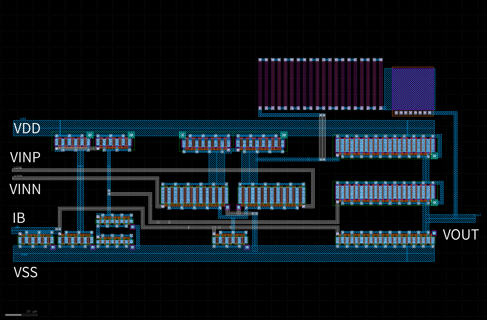
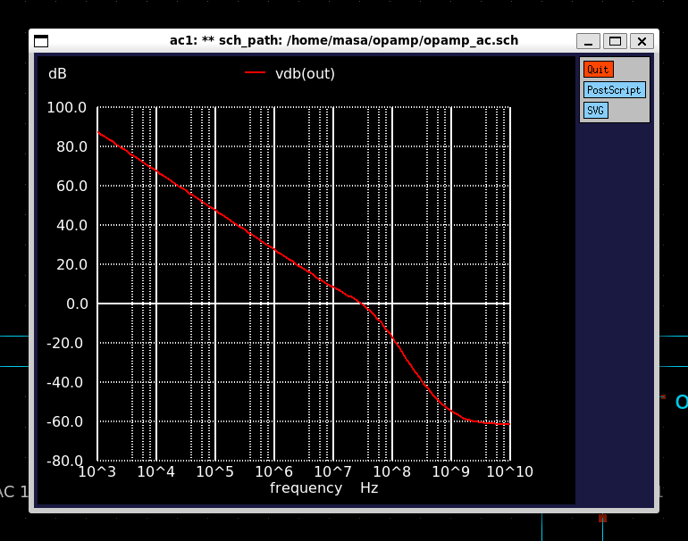

# PTC06-2オペアンプ

Masahiroチーム（チーム組まなかったので個人になります。)の設計データのリポジトリです。

# メンバー

Masahiro [github](https://github.com/pochiMasahiro)

# 作成したオペアンプ
高周波オペアンプ(GBW=100MHz以上)を目指したオペアンプを設計しました。とはいってもそこまで大したことはしていなくて、バイアスを調整するのと、2段目をカスコードソース接地回路にしてみました。基準電流源は設計が間に合わず外部からバイアス電流をいれる構成にしました。10pF負荷で30MHzとなり、ちょっと目標には届きませんでした。

できるかと思ってもよくわからないところが多く数値を変えてたくさん試すという数撃ちゃ当たる作戦になってしまいました。もう少し計算でいい感じのところを探せるようになれるといいなと思います。つぎはもっといい感じの回路を考えるところからやってみたいです。

